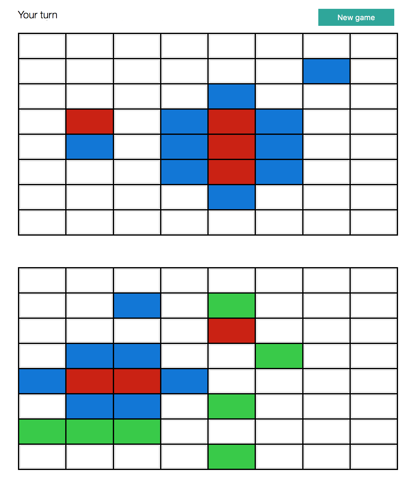

# Mobile-Battleships
This project is a web application to play the <a href="https://en.wikipedia.org/wiki/Battleship_(game)">Battleship</a> game using one of the most known JS libraries for dynamic web pages: <a href="https://vuejs.org">Vue.js</a>. It uses one particular server deployed for the <a href="https://www.ucsc.edu">University of California (Santa Cruz)</a> Mobile Apps course in order to allow the online characteristic of the game.

## How does it work?
As any web application, in order to achieve the proper functionality (play online), the files need to be upload to a hosting service. However, in order to test its correct execution, we could deploy the project using <a href="https://cordova.apache.org">Apache Cordova</a> and simulate a battle between two players using two browser tabs.
<br><br>
The game itself consist on two rectangular grids (one for our ships, and the other one for the opponent ships) in which the user is suppose to destroy the other player ships before their own are sunk. Both users need to specify a <b><i>magic word</i></b> which will act as game identifier, allowing two users to play together if they specify the same magic word. If there exist another user with the same magic word, the game starts and the grids are filled with:
* Three boats of 2 cells long.
* Two boats of 3 cells long.
* One boat of 4 cells long.

</div>

## What is in the repository?
All the code to make the web application work is inside the <i>www</i> folder. Within that folder, There is only 4 files that are relevant from the programmer point of view, because most of them are there just to provide functionality to these 4 files:
* <b>index.html</b>: provides the skeleton of the web app. It additionally imports some important CSS and JS files such as the <a href="https://jquery.com">JQuery</a> and <a href="https://vuejs.org">Vue</a> libraries. 
* <b>css/myapp.css</b>: provides the CSS guides that the HTML elements are going to follow.
* <b>js/board.js</b>: provides our main JS file the random positioning of the ships at the beginning of each game.
* <b>js/index.js</b>: provides the main JS functionality including the Vue structures that are linked to the HTML file.

## Usage:
There are only 3 Cordova functionalities required for the deployment of the project:<br>
<br>
<b>1. Create platform</b>: The following command need to be executed outside the <i>www</i> folder:
```shell
$ cordova platform
```

<b>2. Add browser</b>: After creating the platform, we will need to add <i>"browser"</i> as a runnable platform:
```shell
$ cordova platform add browser
```

<b>3. Execute in browser</b>: Finally, the project could be executed in the desired browser:
```shell
$ cordova run browser --target <browser name>
```

## Requirements:
Although the implementation is designed to work in any browser, in order to deploy the project and simulate a game <a href="https://cordova.apache.org">Apache Cordova</a> must be installed.
